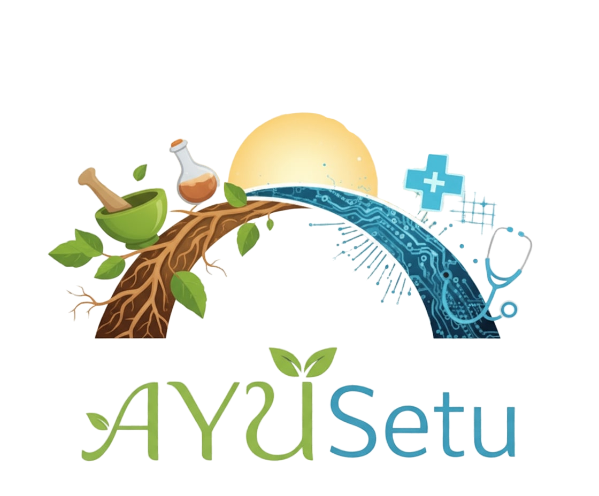

<p align="center">
  
</p>

<h1 align="center">🌿 AYUSetu — A colorful bridge between Traditional Medicine and ICD‑11 ✨</h1>

<p align="center">
  Connect Ayurveda, Siddha, and Unani concepts to ICD‑11 with a friendly FastAPI backend and a sleek Next.js frontend.
</p>

<p align="center">
  <a href="#quickstart">🚀 Quickstart</a> •
  <a href="#what-is-ayusetu">🌈 What is it?</a> •
  <a href="#architecture">🏗️ Architecture</a> •
  <a href="#api-peek">🔎 API Peek</a> •
  <a href="#data--scripts">🧰 Data & Scripts</a> •
  <a href="#troubleshooting">🩹 Help</a>
</p>

<p align="center">
  
  
  
  
  
  
  
</p>

---

## 🌈 What is AYUSetu?

- **Purpose**: Make it easy (and fun!) to search, map, and explore Traditional Medicine terms alongside **ICD‑11**.
- **Backend**: A **FastAPI** service exposing routes for search, suggest, translate, mappings, reports, and more.
- **Frontend**: A **Next.js** app with modern UI (Doctor/Patient dashboards) talking to the API.
- **Data**: Pre-built **SQLite** database and JSON assets for CodeSystems, ValueSets, ConceptMaps, and ICD‑11 entries.
- **Bonus**: Optional **IndicTrans2** integration for Indic↔English translation.

> TL;DR: If you build clinical tools, terminology engines, or research dashboards, AYUSetu has your back. 🧑‍⚕️💻

---

## 🏗️ Architecture

- **api/**: FastAPI app + lightweight startup migrations; JWT-based demo auth
- **frontend/**: Next.js App Router, Tailwind styling, API client via `NEXT_PUBLIC_API_URL`
- **db/**: `terminology.db` plus JSON assets (ICD‑11, ValueSets, ConceptMaps)
- **scripts/**: Fetch/generate/store data utilities
- **indictrans2-*/IndicTrans2/**: Optional local models and upstream code

```
FastAPI (api/)  ←→  SQLite (db/)  ←→  Scripts (scripts/)
        ↑
Frontend (frontend/) — Next.js UI consuming the API
```

---

## 🚀 Quickstart

### Backend (FastAPI)

1) Create and activate a virtual environment

```powershell
python -m venv .venv
.\.venv\Scripts\Activate.ps1
```

2) Install dependencies

```powershell
pip install -r api/requirements.txt
```

3) Create a `.env` at repo root

```dotenv
# .env
SECRET=change-me-in-production
# Optional: override DB path (defaults to db/terminology.db)
# TERMINOLOGY_DB=c:/Users/rishr/sih026/db/terminology.db
```

4) Run the API

```powershell
uvicorn api.main:app --reload --port 8000
```

5) Check it’s alive

```powershell
curl http://localhost:8000/healthz
# {"status":"ok"}
```

OpenAPI docs: http://localhost:8000/docs

### Frontend (Next.js)

1) Install deps

```powershell
Set-Location frontend
npm install
```

2) Create `frontend/.env.local`

```dotenv
NEXT_PUBLIC_API_URL=http://localhost:8000
```

3) Run the dev server

```powershell
npm run dev
# Visit http://localhost:3000
```

---

## 🔎 API Peek (few tasty endpoints)

- Health check

```bash
curl http://localhost:8000/healthz
```

- Auth (demo)

```bash
# Register
curl -X POST http://localhost:8000/auth/register \
  -H "Content-Type: application/json" \
  -d '{"email":"you@example.com","password":"secret"}'

# Login
curl -X POST http://localhost:8000/auth/login \
  -H "Content-Type: application/x-www-form-urlencoded" \
  -d 'username=you@example.com&password=secret'
```

- Search / Suggest

```bash
curl "http://localhost:8000/search?q=arthritis"
curl "http://localhost:8000/suggest?q=fever"
```

- Translate (if wired)

```bash
curl -X POST http://localhost:8000/translate \
  -H "Content-Type: application/json" \
  -d '{"text":"पित्त विकार","src":"hi","tgt":"en"}'
```

- Codesystems & Mappings

```bash
curl http://localhost:8000/codesystems
curl http://localhost:8000/mappings
```

---

## 🧰 Data & Scripts

If you encounter:

```
RuntimeError: terminology.db not found at ... Run step3_store_db.py
```

Rebuild/populate the DB:

```powershell
# from repo root (venv active)
python scripts/step2_generate_codesystems.py
python scripts/step3_store_db.py
# Optional: conceptmaps/valuesets
python scripts/step4_generate_conceptmaps.py
python scripts/step4_generate_valuesets.py
```

The `scripts/` folder also includes ICD‑11 fetching and embedding utilities.

---

## 🧪 Tests

```powershell
pip install -r api/requirements.txt
pytest -q
```

---

## ⚙️ Environment Variables

- **SECRET**: JWT signing secret (demo auth)
- **TERMINOLOGY_DB**: absolute path to `terminology.db` (default: `db/terminology.db`)
- **NEXT_PUBLIC_API_URL** (frontend): API base URL (e.g., `http://localhost:8000`)

---

## 🩹 Troubleshooting

- **DB not found** → run the scripts above to generate `terminology.db`.
- **CORS in dev** → backend allows `*`; ensure `NEXT_PUBLIC_API_URL` matches your API.
- **401 errors** → obtain token via `/auth/login` and send `Authorization: Bearer <token>`.
- **Large model folders** → ignored by default; needed only if you test translation locally.

---

## 🤝 Contributing

- Keep changes small and readable; add tests in `tests/` where helpful.
- Open an issue/PR with a clear description.
- Be kind—we’re building helpful healthcare tech together. 💛

---

## 📄 License

Provided for research and prototyping. Check licenses in any included upstream model/code before redistribution.

---

<p align="center">Made with curiosity, care, and a dash of tradition. 🌿</p>